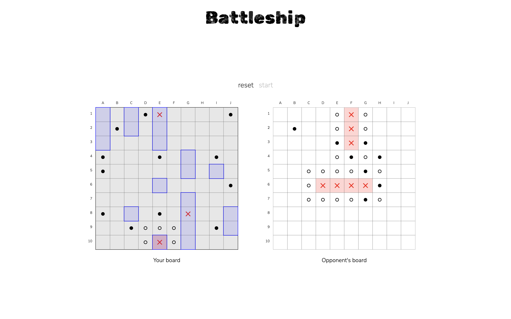

# Battleship

Battleship is a classic game of strategy and precision. The objective is to strategically place your fleet of ships on a grid and take turns with an opponent to target and destroy each other's vessels.

This project served as a platform for refining my object-oriented programming skills while implementing a seamless drag & drop functionality using vanilla JavaScript. Additionally, I applied a Test-Driven Development (TDD) approach to ensure robustness and reliability.

## Table of Contents

- [Demo](#demo)
- [Technologies used](#technologies)
- [Limitations](#limitations)
- [How to Play](#how-to-play)
- [Contributing](#contributing)
- [License](#license)

## Demo

You can view the project at [Battleship](https://sevleo.github.io/TOP-Battleship/).

## Technologies

- Javascript
- CSS
- HTML
- Webpack
- Jest

## Limitations

- The game has only been tested and adjusted for Google Chrome
- The game has not been tested and adjusted for mobile views

## How To Play

- Drag the ships to where you want them to be or click "reset" to assign random positions
- click "start" to start the game
- click tiles on the right board to shoot at enemy fleet
- whoever destroys all enemy ships first, wins

## Contributing

Contributions are welcome! If you'd like to contribute to this project, please follow these guidelines:

1.  Fork the repository.
2.  Create a new branch for your feature or bug fix.
3.  Make your changes and commit them.
4.  Push your changes to your fork.
5.  Create a pull request.

## License

This project is licensed under the [MIT LICENSE](./LICENSE)
